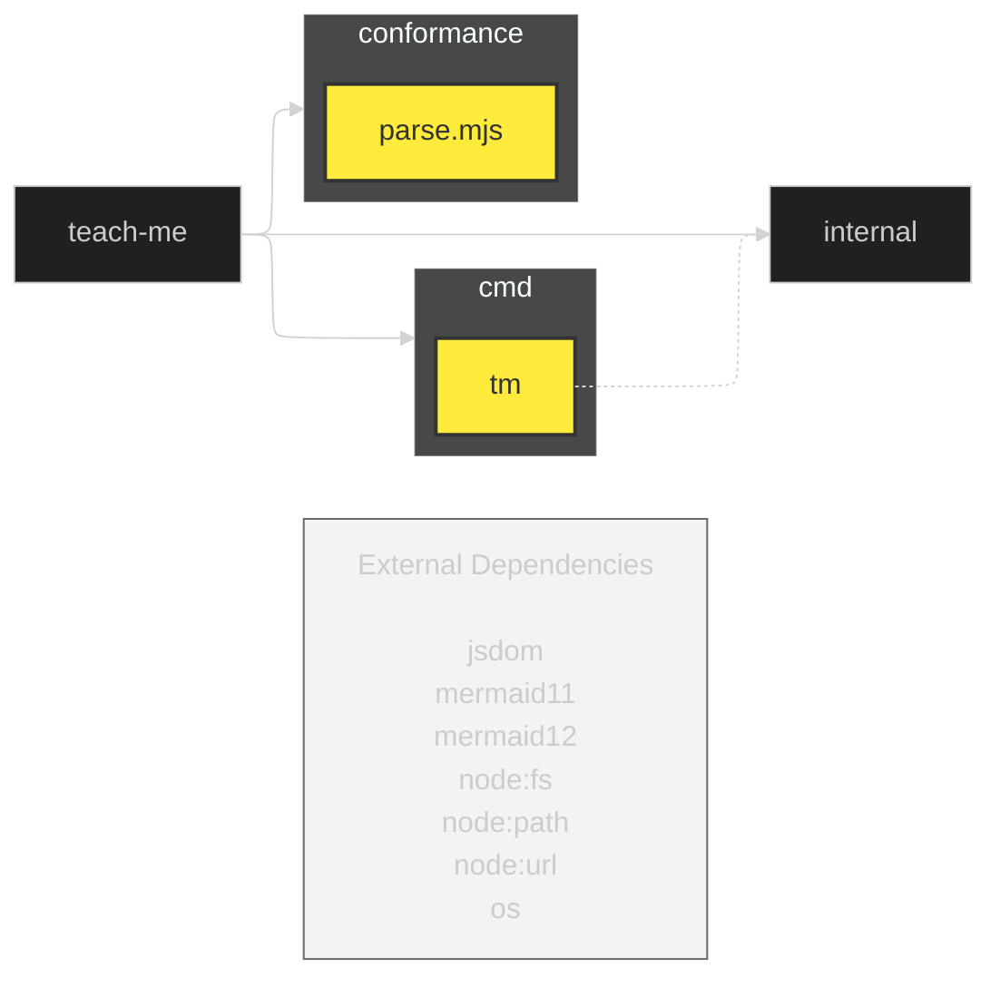

# Code Structure Diagram

```mermaid
---
config:
  look: classic
  darkMode: true
  theme: dark
  layout: elk
  elk:
    mergeEdges: true
    nodePlacementStrategy: NETWORK_SIMPLEX
---
graph LR
    %% Color definitions
    classDef no_deps fill:#90EE90,stroke:#333,stroke-width:2px,color:#333
    classDef has_deps fill:#FFEB3B,stroke:#333,stroke-width:2px,color:#333
    classDef bad_deps fill:#FF6B6B,stroke:#333,stroke-width:2px,color:#333
    classDef external fill:#E0E0E066,stroke:#666,stroke-width:1px

    %% Directory hierarchy
    __3a52ce78 ---> cmd_abac3614
    __3a52ce78 ---> conformance_5500404c
    __3a52ce78 ---> internal_9f33a7c7

    %% Directory structure and files
    __3a52ce78["teach-me"]
    internal_9f33a7c7["internal"]
    subgraph cmd_abac3614["cmd"]
        cmd_tm_d7570c37["tm"]:::has_deps
    end
    subgraph conformance_5500404c["conformance"]
        conformance_parse_mjs_24a216ae["parse.mjs"]:::has_deps
    end

    %% Import dependencies
    cmd_tm_d7570c37 -.-> internal_9f33a7c7

    %% External dependencies
    external["External Dependencies<br/><br/>jsdom<br/>mermaid11<br/>mermaid12<br/>node:fs<br/>node:path<br/>node:url<br/>os"]:::external
    __3a52ce78 ~~~ external
```
