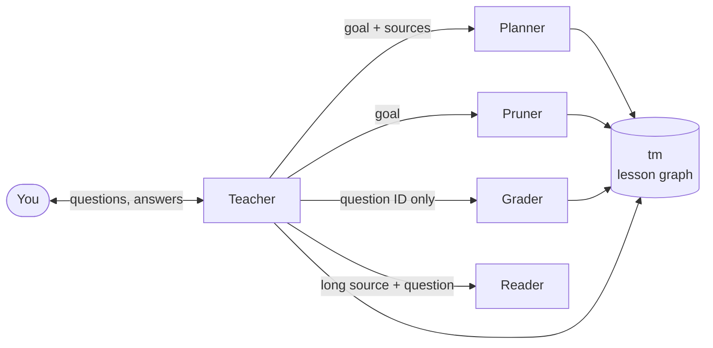
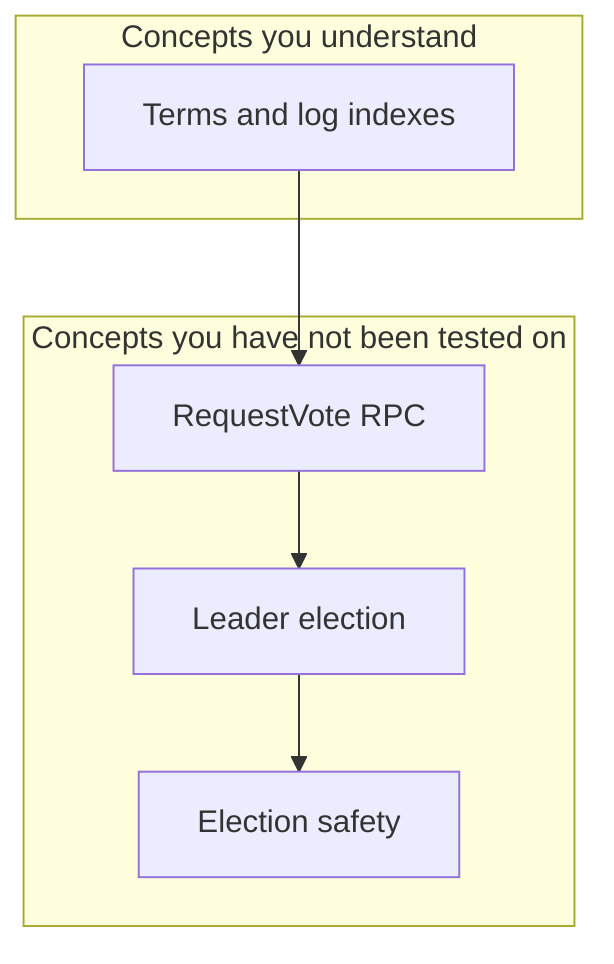

[](https://github.com/Reithan/teach-me/actions/workflows/ci.yml)
[](https://github.com/Reithan/teach-me/actions/workflows/cross-platform.yml)
[](https://github.com/Reithan/teach-me/releases)

# teach-me
teach-me turns an AI coding agent into a patient tutor: it maps what you need to learn from sources you choose, quizzes you on it, and teaches each gap your answers reveal until you reach your goal.

#### _**TL;DR**_:
1. You name a goal and hand over your sources.
2. The agent builds a concept map and quizzes you, one concept at a time.
3. Every answer is graded against the source by a separate agent, so passes are earned, not assumed.

**Contributing**: See [AGENTS.md](AGENTS.md) for development setup, make targets, and architecture.

> [!TIP]
> Skip to the [Quick Start](#quick-start) if you want to just get started.

### How It Works
<details>
<summary>Expand for the roles behind a session</summary>

teach-me has two halves:

- **`tm`**, a small command-line tool that keeps the lesson in one file: a [Mermaid](https://mermaid.js.org/) diagram of concepts, questions, and answers. `tm` enforces the rules, so no agent can mark you passed on a hunch.
- **The skill**, a set of prompt files that tell your agent harness how to drive `tm`. The reference skill targets [Claude Code](https://claude.com/claude-code).



1. **Teacher**: the agent you talk to. It picks the next concept, writes questions, and decides what to teach after a miss.
2. **Planner**: reads your sources and breaks the topic into concepts, each linked to its prerequisites and cited to an exact line range.
3. **Pruner**: cuts the map down to what your goal actually needs and parks the rest in reserve, so you never study a detour.
4. **Grader**: scores one answer against the cited source text, in isolation. It never sees your other answers or the teacher's opinion of you, which keeps the teacher's wish to see you pass out of the score.
5. **Reader**: skims a source too long to read in one piece and reports where the relevant lines are.

The full design lives in the [specification](docs/spec.md).
</details>

## What a Lesson Looks Like
The lesson file is a diagram you can open in any Mermaid viewer (GitHub renders it inline). Concepts move from **untested** to **passed** as you prove you understand them:



<details>
<summary><small>A sample exchange</small></summary>

> **You:** /teach-me I want to understand how Raft elects a leader. Use the Raft paper.
>
> **Teacher:** What do you already know about consensus? … Mapping the paper now.
>
> **Teacher:** *Probe 1:* When does a follower become a candidate?<br>
> *Probe 2:* What must a candidate receive to become leader?
>
> **You:** When it stops hearing heartbeats. It needs votes from… all servers?
>
> **Teacher:** Probe 2 missed. Majority rule is the gap, so let's start there: if a cluster has five servers, how many votes does a candidate need?

Each question cites the passage it tests, and each answer goes to a fresh grader.
</details>

### The Session Loop
#### Probe
**Probes** are short checks on one concept. Pass them all and the concept moves to *passed*, unlocking the concepts that build on it. You can always answer "I don't know"; it counts as a miss, and a miss is where teaching starts.
#### Teach
**Teaching** happens after a missed probe. The teacher records what you misunderstood and asks smaller, guided questions aimed at that gap, then returns to the probes it held back. It's a detour, not a restart.
#### Gate
**The gate** is the circuit breaker. If a concept keeps failing, the teacher stops drilling and steps back: usually a prerequisite is missing, so it maps one in. You can also ask to skip a concept, and it goes to reserve without blocking what comes after it.

## Quick Start
1. [Install `tm` and the skill](#setup--installation).
2. In Claude Code, run `/teach-me` and say what you want to learn.<br>
*For example: "/teach-me I want to read Go generics code comfortably. Use the Go spec and my repo at ~/src/myproject."*
3. Answer the teacher's questions about your goal, what you already know, and where the lesson files should live.
4. Answer probes in your own words. Short, honest answers work best.
5. Come back any time: `/teach-me` resumes from the lesson file right where you left off.

> [!TIP]
> Good sources make good lessons. Versioned docs, papers, textbook chapters, and your own repos all work. Anything the agent writes for you (summaries, study guides) is kept as an *aid* and is never cited as a source.

> [!WARNING]
> You can hand-edit the lesson file, but run `tm lint` afterwards. `tm` refuses to change a file that fails lint, so a broken edit stalls the session until it's fixed.

## Setup & Installation

### Install `tm`
<details>
<summary>Binary and source install</summary>

#### From a release
Download the archive for your platform from [Releases](https://github.com/Reithan/teach-me/releases) (Linux, macOS, and Windows on amd64 and arm64). Each archive holds the `tm` binary plus the `skill/teach-me/` tree. Put `tm` somewhere on your `PATH`.

#### From source
With Go 1.27 or newer:
```sh
go install github.com/reithan/teach-me/cmd/tm@latest
```

Check it with `tm --help --all`, which prints one usage line per command.
</details>

### Claude Code
<details>
<summary>Claude Code setup instructions</summary>

#### Installation
Copy the skill and its sub-agents from the release archive (or this repo):

| From | To |
| --- | --- |
| `skill/teach-me/` | `~/.claude/skills/teach-me/` |
| `skill/teach-me/agents/*.md` | `~/.claude/agents/` |

Use `.claude/` inside a project instead of `~/.claude/` to install for that project only.

#### Point `tm` at the skill
Add one line to `~/.config/tm/config` so `tm --help` points the agent at the skill file:
```
doc = /home/<you>/.claude/skills/teach-me/SKILL.md
```
`tm --help` should now print `see <path>`.

#### Permissions
Keep the agent out of the lesson files so every change goes through `tm`. Add to your `settings.json`:
```json
{
  "permissions": {
    "deny": [
      "Read(**/*.mmd)", "Edit(**/*.mmd)",
      "Read(**/*.mmd.jsonl)", "Edit(**/*.mmd.jsonl)",
      "Read(**/*.mmd.lock)", "Edit(**/*.mmd.lock)"
    ]
  },
  "sandbox": { "excludedCommands": ["tm"] }
}
```

**Sandbox note**: with the bash sandbox on, the deny rules also block `tm` from its own files. The `excludedCommands` entry lets `tm` through while everything else stays blocked.

See [setup.md](skill/teach-me/reference/setup.md) for the full reference, including a deny rule for your source folder.
</details>

### Other Harnesses
`tm` names no model or agent. Any harness that can run shell commands and spawn isolated sub-agents can drive it. Use the files under [`skill/teach-me/`](skill/teach-me/) as the reference adapter.

### Sources and Converters
<details>
<summary>HTML, PDF, and git sources</summary>

`tm` reads plain text directly. For other formats you choose a converter command, and `tm` pins its version so citations stay stable:
```
convert text/html = pandoc -f html -t gfm --wrap=none
convert application/pdf = pdftotext -layout - -
ext html = text/html
ext pdf = application/pdf
version pandoc = <first line of pandoc --version>
```

Git repos are registered once by name (`tm repo add myrepo ~/src/myrepo`) and cited at a pinned commit, so the lesson survives branch changes and moves between machines.

The teacher walks you through this the first time a source needs it. Details: [setup.md](skill/teach-me/reference/setup.md).
</details>

## Tips for Good Sessions
- **State your goal narrowly.** "Understand Raft leader election" makes a tighter map than "learn distributed systems", and the pruner cuts everything the goal doesn't need.
- **Tell the teacher what you already know.** Known material is probed quickly instead of taught.
- **Disagree with a grade?** Say so. The teacher re-asks with a fresh question and a fresh grader decides; it never overrules a grader itself.
- **Sources change.** If a cited page changes, `tm` flags the drift and the teacher re-checks what it affects. Versioned URLs and pinned commits avoid this.

## More
- [Specification](docs/spec.md): the full design of `tm`.
- [Changelog](CHANGELOG.md): what changed in each release.
- Architecture diagrams: [repository structure](CODE_DIAGRAM.md) and [internal packages](internal/CODE_DIAGRAM.md).
