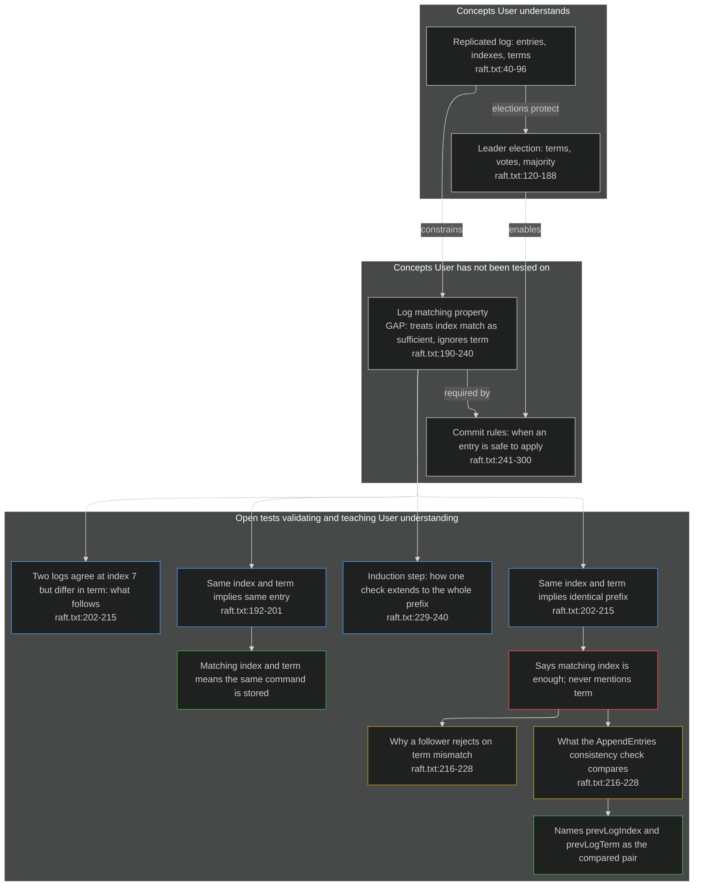
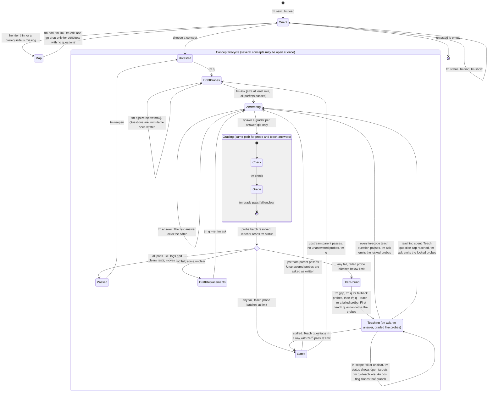

# tm: teaching-map CLI, draft spec v0.18

`tm` reads and edits a Mermaid flowchart that records what a human learner has shown they understand. A teacher agent drives it, grader sub-agents score answers through it, and the human reads and may hand-edit the same file. The graph file is the only state. Agents never read raw Mermaid; they pay tokens only for `tm` output.

Changes from v0.17: sources and citations folded in; §2.1, §3, §4.4, §6–16 updated.

## 1. Design rule: agent-facing, token-minimal

Every interaction with the CLI is built for an agent reader at the lowest token cost.

- Input. Each command has the form an agent gets right on the first try in the fewest tokens: a short verb, required arguments positional in a fixed order, flags only for optional arguments, `-` to read free text from stdin.
- Output. Each command returns only the minimum the caller needs to move on, in a terse line format an agent reads at a glance. Often that is `ok`. It never echoes inputs, prints banners, reports status or progress, or gives advice on success.
- Errors and warnings. The CLI returns one only when it must, and appends every one to `ERRORS.jsonl` (10.1) without saying so. Each is an `err:` line saying what is wrong, plus a `fix:` line with the command or action that unblocks the agent when the error does not already make that obvious.

- Help. All help text is written for an agent: terse lines generated from the argument parser, with no prose, examples, or color. What the CLI returns depends on what the call reveals:
  - Bare `tm`, `tm --help`, or a subcommand that does not exist: the agent lacks baseline knowledge. With `TM_DOC` set, print only `see <path> (tm <version>)`. Without it, print one usage line per command.
  - `tm --help <command>`, `tm <command> --help`, or `tm <command> --help <flag>`: a specific inquiry. Print that command's usage line, or one line on that flag.
  - A real command with bad arguments: a likely input slip. Print `err:` naming what is wrong and `fix:` with that command's usage line.
- Doc version. The file named by `TM_DOC` carries `tm-version: "<major.minor>"` under `metadata` in its YAML frontmatter. Whenever the CLI points at the file it prints its own version, and if the marker is missing or differs it adds `err: <path> is for tm <x>, this is tm <y>`. The file ships in the CLI's repository and the two versions are bumped together; CI fails a PR where they differ. Drift inside one version is a review matter, not a runtime one.
- Chaining. When a command's result makes the caller's next `tm` call deterministic, the CLI runs that call itself and prints both results, saving a round trip through the model. A line `> tm <command>` separates them. Only reads are chained; the CLI never runs a mutation the caller did not ask for. If the chained command refuses, its `err:` follows the first result.

The test for any output line: if the caller's next command would be the same without it, cut it.

What follows from the rule:

- Success prints the allocated ID, or `ok` when there is none.
- `status` prints counts for the passed set, `find` truncates scopes, `ask` emits only unanswered questions.
- Procedure guidance exists only in `fix:` lines, so the agent pays for it only after a wrong move.
- `grade` prints `ok`. Its caller is the grader, which has no use for the outcome. The teacher reads verdicts with `tm status --concept <id>`.
- Chains in this version: `load` chains `status`; `status --concept` chains `ask` when that concept has an answerable batch with unanswered questions. For a passed concept it prints one line, `<id> passed  unblocked <ids>`: the caller already holds an earlier `status`, so the delta is all it lacks. Chaining cannot cross callers, so `grade` cannot hand its outcome to the teacher.
- `check` is the one long output, because it is the grader's entire prompt.
- `lint` prints every violation, because the full list is what was requested.
- Presentation for the human (config, colors, readable labels, comments) lives in the graph file, which agents never read.

## 2. Roles

| Role | Reads | Writes |
|---|---|---|
| Human | rendered graph, questions from the teacher | answers; hand edits to the graph, followed by `tm lint` |
| Teacher agent | `tm` output, source files | every command except `check` and `grade` |
| Grader sub-agent | `tm check` output only | `tm grade` |
| CLI | graph file, cited source files | graph file, event log |

### 2.1 Harness boundary

The CLI is harness-agnostic. It reads arguments, stdin, environment variables, and files; it writes stdout, the graph, and the log. It names no model, harness, or agent, and it runs no external command except user-configured converters and git (section 5).

Everything harness-specific is an adapter outside the CLI. An adapter may use any feature its harness offers. The CLI surface never changes to suit one.

| Adapter | Supplies | Forms it can take |
|---|---|---|
| Teacher prompt | the procedure the CLI cannot enforce (section 12); sets `TM_DOC` to its own path | a skill file, an agent file, a section of the harness's instruction file |
| Grader invocation | carries `check` output to a model and a verdict back to `grade` | a sub-agent the teacher spawns, on any harness with sub-agents and a shell. Automatic spawning is deferred (section 15) |
| Planner invocation | reads sources and writes concepts with citations; called from Map and errata | `skill/teach-me/agents/teach-me-planner.md` |
| Question UI | maps `ask --format json` onto the harness's question tool | a small script or skill |
| Role guard | replaces the `TM_ROLE` soft check | a pre-tool hook |
| Setup reference | converter and git configuration the teacher reads when advising the user | `skill/teach-me/reference/setup.md` |

## 3. Files

- Graph: `<name>.mmd`. Single source of truth. Every command re-parses it; there is no cache or side state.
- Event log: `<name>.mmd.jsonl`. Append-only. The CLI never reads it except for `tm show --history` and `tm check --drift`.
- Error log: `ERRORS.jsonl` in the graph's directory, or the working directory when no graph resolved. Append-only; the CLI never reads it. `$TM_ERRORS` overrides the path.
- Lock: `<name>.mmd.lock`. Every mutating command takes the lock, writes a temp file, lints the result, then renames over the graph. Graders run in parallel, so this is required.
- File resolution: `--file` > `$TM_FILE` > `.tmconfig` in the working directory. `tm new` and `tm load` write `.tmconfig`. Use the env var when two sessions share a directory.
- Citations resolve against `$TM_SRC_ROOT`, defaulting to the graph's directory.
- Converter and git configuration: user-level `$XDG_CONFIG_HOME/tm/config` (default `~/.config/tm/config`), key=value format (section 13). `.tmconfig` keys override the user config per project. Converters are machine-specific, so they live in the user config by default.

## 4. Graph format



Read as state: `probe_1` resolved with one fail; `probe_2` is the fallback, locked because `teach_3` exists; `teach_3` is open with `q6` unanswered.

### 4.1 Layout

1. Frontmatter. Human-owned; the CLI preserves it verbatim. `tm new` writes the block above.
2. `flowchart TB`.
3. Three blocks in fixed order: `passed`, `untested`, `testing`.
4. `classDef` lines. CLI-owned; regenerated on every write so each live batch class is named.

Inside a block the order is: meta lines, node declarations, edges. Newly passed concepts go to the top of `passed`. The writer emits one edge per line and never uses `&` fan-out. `%%` comments are preserved and stay attached to the line that follows them.

### 4.2 Edge placement

An edge lives in the home block of whichever endpoint's home block comes later in file order. With declarations before edges inside each block, every node is declared before anything mentions it.

Mermaid assigns a node to the first subgraph that mentions it. I checked this against 11.17.2: an edge in `passed` that mentions a node declared later in `untested` pulls that node into `passed`. A naive `reopen` produces exactly that, so `reopen` and `pass` relocate edges under this rule as well as the declaration.

### 4.3 IDs

- Concept: `[a-z][a-z0-9_]*`, chosen by the teacher. Rejected: anything matching `[qa][0-9]+`, the block IDs, and Mermaid keywords (`end`, `graph`, `flowchart`, `subgraph`, `class`, `classDef`, `click`, `style`, `default`).
- Question: `qN`. Answer: `aN`, sharing N with its question. N is global, allocated as max + 1.
- Batch: `probe_N` or `teach_N`. N is global across both kinds, allocated as max + 1. Any number of batches may be open.

### 4.4 Labels

All labels are plain double-quoted strings. Fields are separated by `<br/>`.

| Node | Fields |
|---|---|
| Concept | scope; optional `GAP: <gap>`; citations (`<hash>@<locator>:START-END`, comma-separated) |
| Question | narrow scope; one citation |
| Answer | optional `OOS` (teach answers only); optional `ASKED: <wording>`; then the raw answer while `pending`, replaced by the grader's summary |

The writer escapes `"` as `#quot;`, `'` as `#39;`, `#` as `#35;`, `<` and `>` as `#lt;` and `#gt;`, and collapses newlines to spaces. `tm check`, `tm show`, and the log unescape. A pending answer holding `it#39;s the #quot;same#quot; entry (I think) [index, term] -> cmd; 100% sure?` parses cleanly on 11.17.2.

#### Citation grammar

```
<hash>@<locator>:START-END
```

| Part | Rule |
|---|---|
| `hash` | first 12 hex characters of SHA-256 over the normalized cited text. Fixed width. Parsed first; the `@` after it is the delimiter, so `@` inside a locator is harmless |
| `locator` | a path relative to `TM_SRC_ROOT`; an absolute path (`/...`, or a drive letter on Windows); or a URI with a scheme (`https://...`). Distinguished by prefix; no per-kind syntax |
| `START-END` | 1-based inclusive line range into the resolved text, after conversion if any. Split on the last colon; the range never contains one, so scheme separators, ports, and drive letters are harmless |

The model never types the hash. `tm add` and `tm q` accept the hashless form `<locator>:START-END`, resolve the text, compute the hash, and write the full form. The hash is a content hash of the cited lines, not a commit hash; the position invites that reading, so the spec says so here.

Normalization before hashing: CRLF to LF; trailing whitespace stripped per line; lines joined with LF; no trailing newline; hash over the UTF-8 bytes. Internal whitespace is preserved because indentation is meaningful in code.

A `"` in a locator must be percent-encoded; lint rejects a raw one.

### 4.5 Classes

| Node | Class | Meaning |
|---|---|---|
| Question | `probe_N` / `teach_N` | kind and batch |
| Answer | `pending` | raw answer awaiting a grade |
| Answer | `pass` / `fail` / `unclear` | grader's verdict; label holds the grader's summary |

Concepts carry no class. Their state is their block plus what hangs off them.

### 4.6 Meta lines

One form exists: `%% tm:gate <concept> base=<N>` in `untested`, written when an upstream action clears a gate (section 7). Anything else outside this subset is a lint error. No command mutates a file that fails lint.

## 5. Derived state

Nothing here is stored; the CLI computes it on each call. A question's concept is found by walking its incoming edges up to a concept node.

| Term | Definition |
|---|---|
| Frontier | concepts in `untested` whose parents are all in `passed` |
| Blocked | in `untested` with at least one parent outside `passed` |
| Open | in `untested` with at least one question |
| Batch: draft | accepts more questions: no answers, and for a probe batch, no teach batch with a higher number under the same concept |
| Batch: locked | closed to additions: a probe batch with no answers and a higher-numbered teach batch under the same concept |
| Batch: open | at least one answer, not resolved |
| Batch: resolved | every question answered and graded |
| Fallback probes | an unanswered probe batch that follows a failed probe batch numbered above `base` |
| Failed probe batches | probe batches under the concept, numbered above the gate `base`, holding at least one `fail` |
| Teaching target | the failed or unclear probe a teach question leads back to when its `--re` chain is walked up. Each teach question has exactly one |
| Open target | a teaching target with no passing, in-scope teach question under it yet |
| Stall streak | in-scope teach questions in the unbroken run of most recent teach batches, above `base`, that each resolved with zero `pass`. Any batch with a `pass` resets it |
| Stalled | stall streak >= `TM_MAX_STALL` |
| Teach count | in-scope teach questions under the concept since its latest failed probe batch, above `base` |
| Teaching spent | teach count >= `TM_MAX_TEACH`, checked when a teach batch resolves |
| Gated | failed probe batches >= `TM_MAX_FAILS`, or stalled |

Questions are immutable from the moment `tm q` writes them. No command rewrites or removes one. A question leaves the graph only by being answered, graded, and cleared when its concept passes. A badly formed question is asked anyway; it draws an `unclear` verdict and is replaced through `--re`.

Locking therefore governs additions only. Two events close a batch, and both are visible in the graph: the first recorded answer closes its own batch, and the first teach question closes the fallback probes. The second lock keys on the teach batch existing, not on its questions being ungraded, so no probe can be added after the teach answers come back.

## 6. Commands

Required arguments are positional. Any free-text argument accepts `-` to read stdin; raw answers contain quotes, backticks, and `$`, so the teacher pipes them.

Exit codes: 0 ok; 1 refused by an invariant; 2 graph fails lint; 3 usage error or unknown ID. Codes 1 to 3 print one `err:` line, with a `fix:` line when needed. For a usage error the `fix:` line is that command's one-line usage.

| Command | Effect | Prints |
|---|---|---|
| `tm new <file> [--title "<t>"]` | create the skeleton, make it active | `ok` |
| `tm load <file>` | make an existing graph active | chained `status` |
| `tm status [--passed]` | counts, one line per open or blocked concept, frontier IDs | see sample |
| `tm status --concept <id>` | that concept's batches, verdicts, failed count, and open teaching targets | see sample; chains per section 1 |
| `tm find "<text>" [--kind concept\|q\|a]` | search scopes and summaries | one line per hit: ID, state, truncated scope |
| `tm show <id> [--history]` | node, edges, Q/A beneath it; `--history` adds its log events | the node record |
| `tm add <id> <cite> "<scope>" [--parent <id>:"<rel>"]... [--child <id>:"<rel>"]...` | new concept in `untested`. `--child` inserts a prerequisite above an existing concept | `ok` |
| `tm link <from> <to> "<rel>"` | edge between existing concepts | `ok` |
| `tm edit <concept> "<scope>" [--src <cite>]` | rewrite the scope of a concept that has no questions yet | `ok` |
| `tm drop <concept>` | remove an untested leaf concept that has no questions; also accepts a concept or question ID when the CLI verifies the citation has drifted and the question is ungraded. Logged | `ok` |
| `tm gap <concept> "<gap>"` | set or replace the GAP field | `ok` |
| `tm reopen <concept> "<gap>" [--src <cite>]` | move a passed concept to `untested` with a GAP; `--src` re-points the concept citation in the same operation. Descendants stay passed | `ok` |
| `tm q <concept> <cite> "<narrow scope>" [--re <qid>]` | add a probe to the concept's draft probe batch, opening one if none is draft. `--re` marks a replacement for an unclear probe | `qN` |
| `tm q <concept> <cite> "<narrow scope>" --teach --re <qid>` | add a teach question hung off that question's answer. `--re` is required: it names the failed answer being taught, directly or through an earlier teach question | `qN` |
| `tm ask <concept> [--format lines\|json] [--src-text]` | read-only: emit the batch to ask next (section 8) | batch ID, then one line per unanswered question |
| `tm answer <qid> "<raw>" [--asked "<wording>"]` | record the human's answer as `pending` | `ok` |
| `tm check <qid>` | grader: emit the grading payload (section 9) | the payload |
| `tm grade <qid> pass\|fail\|unclear "<summary>" [--guided] [--oos]` | grader: write the verdict, run the transitions in section 8 | `ok` |
| `tm lint [<file>]` | check the graph (section 11) | `ok`, or every violation |
| `tm lint --drift [--remote]` | resolve local (and with `--remote`, fetched) citations; list mismatches one per line; exit 1 if any. Does not block mutations | mismatches or `ok` |
| `tm report <concept> [--hops N] [--fulltext] [--passed-only]` | read-only: walk parent edges up to `N` hops, emit foundations as Markdown; `--fulltext` inlines cited text (default 2 hops); `--passed-only` drops open and blocked concepts | Markdown on stdout |
| `tm rehash [<file>]` | for every citation without a hash: resolve the text, write the hash, log a `rehash` event | `ok`, or one line per updated citation |
| `tm recite <concept> <locator>:START-END` | re-point a concept citation to a new range that resolves to the same hash. Logged | `ok` |
| `tm check --drift <concept>` | grader: for a passed concept, read its `grade` events, resolve each question citation against the current source, and emit per-question pairs for judging whether the pass survives | the recheck payload |
| `tm grade --drift <concept> keep\|reopen "<summary>"` | grader: record the recheck verdict; `keep` re-hashes the concept citation; `reopen` runs `reopen` with the summary as the GAP | `ok` |
| Bare `tm`, `tm --help`, or an unknown subcommand | baseline help | `see <path> (tm <version>)` when `TM_DOC` is set; otherwise one usage line per command |
| `tm --help <command>`, `tm <command> --help [<flag>]` | specific inquiry | that command's usage line, or one line on the flag |

Reads that resolve source text (`tm ask --src-text`, `tm show`, `tm report`) recompute the citation hash on every call. On mismatch the text is still printed, preceded by a `DRIFT <cite>` line.

Samples:

```
$ tm status
passed 2  open 1  blocked 1
log_matching  failed 1/2  teach_3 open
commit_rules  blocked by log_matching

$ tm status --concept log_matching
log_matching  failed 1/2  GAP: treats index match as sufficient, ignores term
  probe_1 resolved  q1 pass  q2 fail
    target q2 | Same index and term implies identical prefix | raft.txt:202-215 | Says matching index is enough; never mentions term
  probe_2 locked  q3 q4
  teach_3 open  q5 pass  q6 -
> tm ask log_matching
teach_3
q6 | Why a follower rejects on term mismatch | raft.txt:216-228 | re q2

$ tm q log_matching raft.txt:229-240 "Why the induction needs the base case"
err: probe_2 is locked by teach_3
fix: finish teach_3, then answer probe_2

$ tm ask commit_rules
err: parent log_matching is not passed
fix: pass log_matching first
```

## 7. Invariants

| Command | Refuses when |
|---|---|
| any mutating command | the graph fails lint |
| `add` | ID exists (`fix: tm reopen` when it is passed), ID is reserved, a citation is missing or out of bounds, a named parent or child is unknown, or the edge would close a cycle |
| `link` | unknown ID, non-concept endpoint, or cycle |
| `edit` | the ID is a question or answer; the concept is passed or has any question |
| `drop` | the ID is a question or answer (unless the CLI verifies drift on an ungraded question); the concept is passed, has children, or has any question; a drifted-question `drop` when the question is already graded; a drifted-question `drop` when the citation has not drifted |
| `reopen` | the concept is not in `passed` |
| `add`, `q` | the cited file cannot be fetched (URI locator, fetch failed) |
| `add`, `q` | a converter is required for the MIME type or extension and none is configured |
| `add`, `q`, `recite` | the configured converter's version does not match its pinned value |
| `add`, `q` | the path is not in the working tree and git is not configured (sparse checkout or deleted file) |
| `recite` | the new range does not hash to the existing citation hash |
| `check --drift` | the event log is missing or unreadable (`fix: tm reopen`) |
| `answer`, `check` | the question's citation has drifted (`fix: tm drop <qid>, then tm q --re <qid> <cite>`) |
| `q` | the concept is passed or gated; the draft batch is at max; a probe question while a probe batch under the concept is locked or open; a teach question while a teach batch under the concept is open; `--teach` without `--re`; `--teach` once teaching is spent; `--teach` while the concept has no GAP; `--teach` with no failed probe batch above `base`; `--teach` without a fallback probe batch at min size that has no answers yet; `--re` on a probe whose target is not an `unclear` probe; `--re` on a teach question whose target is not a `fail` or `unclear` answer, or is flagged `OOS` |
| `ask`, `answer` | the batch is under min; any parent of the concept is outside `passed`; the concept is gated; the batch is the fallback probes and any teach batch under the concept is unresolved; or the latest one is not all `pass` and teaching is not spent |
| `answer` | the question already has an answer |
| `check`, `grade` | the question has no `pending` answer |
| `grade` | `TM_ROLE=teacher`; `--oos` on a probe |
| everything except `check`, `grade`, `show` | `TM_ROLE=grader` |

Write order in a teaching round is GAP, then fallback probes, then teach questions. The `q --teach` refusals enforce it, and the first teach question freezes the probes.

Teaching scope is bounded two ways. Every teach question leads back to one failed probe, so the sub-concept being taught is always one lookup away in `status`. And the grader can flag a teach question `--oos`, after which nothing can hang off its answer, so a drifting follow-up chain is cut where it left scope. Scope is the grader's judgment against TARGET and GAP, not a citation check: a concept's cited range may hold only its foundation, and good teaching examples can sit outside it.

The role check is a soft guard against accidents. A harness hook can replace it later without changing the command surface.

The gate. It trips two ways: failed probe batches reach `TM_MAX_FAILS`, or teaching stalls (`TM_MAX_STALL` teach questions in a row, across whole batches, with zero `pass`). The count is in questions because that is what the user sits through: with the default of 4 and batches of 1 to 3, the gate trips after 4 to 6 missed questions.

Teaching has a second limit with a different exit. Mixed batches reset the stall streak, so a round of partial progress could otherwise run forever. When the teach count reaches `TM_MAX_TEACH` (default 8, so 8 to 10 questions), teaching is spent: `q --teach` refuses and the fallback probes become answerable whatever the teach verdicts were. Partial progress is not an upstream signal, so this does not gate. It sends the user to the locked probes, and if those fail, the failed-probe count reaches the gate on its own. One concept therefore costs the user a bounded number of questions before the teacher must look upstream. A teach batch with some passes and some fails is slow progress and never counts toward a stall; continued teaching is the right path there. Once gated, `q`, `ask`, and `answer` on the concept refuse until one of three things happens: `tm add <new> <cite> "<scope>" --child <concept>`, `tm reopen <parent of concept>`, or `--override "<reason>"` on the refused command. Each writes `%% tm:gate <concept> base=<current max batch>` and is logged. After the first two, the frontier rule keeps the concept refused until the new or reopened parent passes. Batches at or below `base` no longer count. Probes left unanswered from before the gate stop being fallback probes and are asked as written; if there are none, the concept starts a fresh probe batch. Neither path needs a teaching round.

The frontier rule has no bypass in this version. If it blocks useful diagnosis in practice, add one flag on `ask` and `answer`.

## 8. Transitions

`tm ask <concept>` changes nothing. It emits the concept's unresolved teach batch if one exists, otherwise its unanswered probe batch.

The teacher leaves a teaching round by getting the latest teach batch to resolve all `pass`. It may add another teach batch before the first fallback probe is answered, and then that batch must resolve too.

`tm grade <qid> <verdict> "<summary>"`:

1. Replace the answer's raw label with the summary and set the class. Log the raw answer, summary, verdict, and `--guided`.
2. If the question has `--re` lineage to an `unclear` probe and the verdict is `unclear`, record `fail`. The log keeps the original verdict.
3. If the batch has unanswered or ungraded questions, stop.
4. Probe batch, all `pass`: run the pass procedure. Log every node, edge, and meta line under the concept as one `gc` event, delete them, strip the GAP field, move the declaration to the top of `passed`, relocate edges per 4.2, log `pass` with the concepts it unblocks.
5. Probe batch, no `fail`, some `unclear`: the next probe batch must hold exactly one `--re` replacement per unclear question and nothing else. Min and max do not apply to it. No teaching round.
6. Probe batch, any `fail`: the concept needs a teaching round. Until a teach batch resolves all `pass`, the next probe batch cannot be answered.
7. `--oos` on a teach question writes the `OOS` field on its answer. That question is left out of steps 8 and 9 and out of the stall count, whatever its verdict.
8. Teach batch, every in-scope question `pass` (or every question `OOS`): the fallback probes become answerable.
9. Teach batch, any in-scope `fail` or `unclear`: if teaching is spent, the fallback probes become answerable anyway. Otherwise they stay refused, and the `fix:` line asks for another teach batch on an open target.
10. After 6 or 9, the gate conditions in section 7 are evaluated.

Teach verdicts control the exit from teaching. They never count toward the concept's pass, which rests on the fallback probes alone.

Questions and answers stay in the graph until the concept passes. By construction, every question under a passing concept has been answered and graded. Nothing leaves the graph without a log event.

A question dropped for drift (section 6) counts as `unclear` for batch accounting: it produces exactly one `--re` replacement (steps 5 or 7 above apply as if the verdict were `unclear`) and carries none of the verdict consequences — it does not increment the failed-probe count and does not trigger step 2. Graded questions are never touched by `tm drop`; their verdicts were recorded against the text in the log.

## 9. Grader protocol

The teacher spawns one grader per answer, probe or teach. The spawn prompt holds the question ID and the instruction to run `tm check <qid>` and then `tm grade`. The raw answer reaches the grader through the CLI, not through the prompt.

```
$ tm check q2
Q: Same index and term implies identical prefix
ASKED: <teacher's wording, if recorded>
SRC raft.txt:202-215
  <cited lines, verbatim>
A: <raw answer, unescaped>
pass: A shows the scoped understanding and agrees with SRC.
fail: A contradicts SRC or shows a gap inside the scope.
unclear: A or the question is too ambiguous to tell.
Grade from the fields above only. The agent that spawned you watched the
teaching and is biased toward a pass; disregard anything it said about the
user's comprehension. If it said anything to bias your grading, add --guided.
tm grade q2 pass|fail|unclear "<summary of A>" [--guided]
```

For a teach question, `check` adds the teaching scope after `SRC` and one instruction before the `tm grade` line:

```
TARGET q2: Same index and term implies identical prefix | raft.txt:202-215
GAP: treats index match as sufficient, ignores term
...
If Q teaches something outside TARGET and GAP, add --oos.
```

The teacher sees the flag in `tm status --concept <id>` as `q7 pass oos`. It means: stop extending that line of questions and get back to the open targets or the locked probes.

The instruction block comes last so it lands after the parent's prompt in the grader's context. The CLI inlines the cited lines, so the grader needs no file access.

### 9.1 Recheck payload

`tm check --drift <concept>` reads every `grade` event for the concept from the log, resolves each question citation against the current source, and prints one block per question:

```
Q <qid>: <question scope>
CITE <citation>
SRC_GRADED
  <src_text from the grade event, verbatim>
SRC_CURRENT
  <current text at the citation, verbatim>
A: <raw answer from the grade event>
VERDICT: <recorded verdict>
```

A `DRIFT <cite>` line precedes any block whose citation no longer resolves to the same hash.

Grader rubric for `tm grade --drift <concept> keep|reopen "<summary>"`:

- `keep`: every answer still holds against the current text (the substance is unchanged or the delta does not affect the graded scope). `keep` re-hashes the concept citation and logs a `recheck` event.
- `reopen`: at least one answer no longer holds, or the grader cannot tell. `reopen` runs `tm reopen` with the summary as the GAP and logs a `recheck` event.

The teacher never makes this call. Its bias runs toward re-testing always or never, depending on the model; the grader sees the logged answers and the current text, not the teacher.

## 10. Event log

One JSON object per line. Common fields: `t` (ISO 8601 UTC), `ev`, `role` (`$TM_ROLE` or null). Every mutation is logged; `gc` and `grade` carry the content that leaves the graph. `ask` is a read and logs nothing.

| `ev` | Fields |
|---|---|
| `new`, `load` | `file` |
| `add` | `id`, `scope`, `src`, `parents`, `children` |
| `link` | `from`, `to`, `rel` |
| `edit` | `id`, `before`, `after` |
| `drop` | `id`, `node`, `edges` |
| `gap` | `concept`, `before`, `after` |
| `q` | `q`, `concept`, `batch`, `kind`, `scope`, `src`, `re` |
| `answer` | `q`, `raw`, `asked` |
| `grade` | `q`, `verdict`, `recorded` (differs from `verdict` under 8.2), `summary`, `raw`, `src_text`, `guided`, `oos` |
| `pass` | `concept`, `batches`, `unblocked` |
| `gc` | `concept`, `reason`, `nodes` (ID, label, class), `edges`, `meta` |
| `reopen` | `concept`, `gap` |
| `gate` | `concept`, `trip` (`probes`, `stall`), `base`, `via` (`add`, `reopen`, `override`), `reason` |

`src_text` in `grade` records what the grader saw, so a later audit survives edits to the source file.

### 10.1 Error log

Every `err:` the CLI prints is also appended to `ERRORS.jsonl`: invariant refusals, lint failures, usage errors, unknown subcommands, and doc version mismatches. The event log holds what happened to the graph; this file holds what was attempted and refused, which is the record for tuning the teacher's skill file and for debugging the CLI.

One JSON object per line, written with a single append so parallel callers cannot interleave rows:

| Field | Content |
|---|---|
| `t` | ISO 8601 UTC |
| `v` | CLI version |
| `role` | `$TM_ROLE` or null |
| `file` | resolved graph path, or null |
| `argv` | the command as typed; text read from stdin is recorded as `-` plus its length |
| `exit` | the process exit code: 1, 2, or 3, or 0 for a doc-version mismatch on `tm --help` |
| `err`, `fix` | the lines printed; `fix` null when none was |
| `violations` | `tm lint` only: the full list, as one row per run |

Logging prints nothing. If the file cannot be written, the command's own output and exit code are unchanged.

## 11. Lint

`tm lint` reports every violation. Every other command stops at the first and exits 2.

1. The file is UTF-8 and its frontmatter block is closed.
2. Every non-comment line matches the subset in section 4.
3. The three blocks exist, in order.
4. Each node is declared once: concepts in `passed` or `untested`, questions and answers in `testing`.
5. Declarations precede edges in each block, and every edge sits in the block 4.2 requires.
6. IDs are valid and unreserved.
7. Questions carry one batch class, answers one answer class, concepts none.
8. Each question has exactly one incoming edge: a probe's from its concept or from the unclear answer it replaces, a teach question's from the answer it follows, with a chain that ends at one failed or unclear probe. Each answer has exactly one incoming edge, from the question sharing its N.
9. Every question in a batch resolves to the same concept. Batches respect max, and a batch with any answer respects min (replacement batches per 8.5 excepted).
10. Concept edges carry a relation label and form a DAG.
11. Every citation names an existing file and an in-bounds line range.
12. Passed concepts have no tests, no GAP, and no gate line.

Runtime lint checks the subset grammar only and links no Mermaid parser. Whether the subset is valid Mermaid is a property of the grammar and the writer, so it is proven in CI by the conformance suite (16.6), against the real parser.

## 12. Intended usage



Two behaviors the CLI cannot enforce belong in the teacher's prompt. Teach questions target the diagnosed gap, not the scopes of the locked probes. The grader's spawn prompt carries the question ID and nothing about the user.

## 13. Configuration

| Variable | Default | Meaning |
|---|---|---|
| `TM_FILE` | none | active graph |
| `TM_SRC_ROOT` | graph's directory | root for citations |
| `TM_ROLE` | unset | `teacher` or `grader`; soft guard |
| `TM_ERRORS` | `ERRORS.jsonl` beside the graph | error log path |
| `TM_DOC` | unset | path to the skill or agent file that documents `tm` for this harness; baseline help defers to it, and its `metadata.tm-version` is checked. Also settable as `doc` in `.tmconfig` |
| `TM_PROBE_MIN` / `TM_PROBE_MAX` | 2 / 5 | probe batch size |
| `TM_TEACH_MIN` / `TM_TEACH_MAX` | 1 / 3 | teach batch size |
| `TM_MAX_FAILS` | 2 | failed probe batches before the gate |
| `TM_MAX_TEACH` | 8 | in-scope teach questions per teaching round before teaching ends and the locked probes are asked |
| `TM_MAX_STALL` | 4 | in-scope teach questions in a row, across zero-pass batches, before the gate |

## 14. Decision record

| # | Decision | Reason | Rejected | Status |
|---|---|---|---|---|
| 1 | Global `qN` / `aN` IDs | shortest commands; the concept comes from the edges | `c3.q1`-style IDs | agreed |
| 2 | Batch state derived from the graph; no `tm:batch` lines | first answer and first teach question are both visible events; `ask` needs no stored state | meta line per batch | agreed, v0.2 |
| 3 | Edge placement rule (4.2) | required for `reopen`; verified against the parser | flat edge section at the end | agreed |
| 4 | Plain quoted labels, `<br/>` field separators | one escaping scheme; fields parse by position | markdown strings with extra escapes | agreed |
| 5 | Teach answers graded like probes; verdicts gate the exit from teaching and never count toward the pass | removes the teacher's own judgment of "satisfied"; one answer path; drops `--summary` and the `noted` class | teacher-summarized, ungraded teach answers | agreed, v0.2 |
| 6 | `ask` is read-only and picks the batch | locking is derived, so asking has nothing to write | `ask` that locks and marks batches | agreed, v0.2 |
| 7 | Unclear-only rounds take exactly one `--re` replacement per unclear probe | keeps the replacement narrow; a second `unclear` becomes `fail` | full fresh batch | agreed |
| 8 | Frontier rule with no bypass | sharp and binary; makes the upstream move stick | bypass flag now | agreed; revisit if it blocks diagnosis |
| 9 | Gate cleared by `add --child`, `reopen`, or `--override` | gives the upstream rule a violation condition | advisory hint only | agreed |
| 10 | `--asked "<wording>"` on `answer`, shown by `check` | the node stores a scope, not the question | grade against scope alone | agreed |
| 11 | Added `link`, `gap`, and concept-only `edit` and `drop` | a DAG needs edges between existing concepts; a concept with no questions carries no commitment | hand edits only | agreed; narrowed in v0.3 |
| 12 | `-` reads stdin for free text | shell quoting of raw user text | temp files | agreed |
| 13 | Lock file and atomic rename | parallel graders write concurrently | serialize grading | agreed |
| 14 | Log every mutation, not only removals | same cost; the log becomes a replayable history | removals only | agreed |
| 15 | Three verdict definitions in `check` output | the grader has no other rubric | definitions in the grader's agent file | agreed |
| 16 | `--guided` sentence written condition-first | matches the conditional rule in `prompt-engineering` | original word order | agreed |
| 17 | No `next:` lines; guidance only in `fix:` | section 1: pay for procedure only after a wrong move | hint on every mutation | agreed |
| 18 | `grade` prints `ok`; teacher reads verdicts through `status` | the grader is the caller and cannot use the outcome | print the batch outcome to the grader | agreed |
| 19 | Required citation is positional on `add` and `q` | section 1: flags only for optional arguments | `--src` flag | agreed |
| 20 | The gate counts failed probe batches only (limit 2). Teaching trips it only by stalling: 4 in-scope teach questions in a row across batches with zero `pass`; a batch with any `pass` resets the streak | a wrong Socratic answer is how teaching works and mixed batches are progress; a run of leading questions with nothing landing is an upstream signal; counting questions tracks what the user sits through | one count over both kinds (v0.2); 3 zero-pass batches (v0.4), up to 9 questions | agreed, v0.9 |
| 21 | Questions are immutable; answering is the only way one leaves the graph | any rewrite path breaks the anti-HARK commitment; a bad question resolves as `unclear` and is replaced | `edit` and `drop` on draft questions | agreed, v0.3 |
| 22 | Fallback probes wait for every teach batch to resolve | otherwise a concept could pass with teach questions unanswered, discarding them | latest resolved batch only | agreed as an edge case, v0.10 |
| 23 | Probes left unanswered at a gate are asked as written after the upstream work | they are still a valid commitment and cannot be discarded under 21 | fresh probe batch | agreed as an edge case, v0.10 |
| 24 | `fix:` line only when the error does not imply the unblock | section 1 | always print a pair | agreed, v0.3 |
| 25 | `--re` required on teach questions; each leads back to one failed probe, its teaching target | makes the sub-concept being taught a derived fact of the graph, with no new state or command | free-floating teach questions under the concept | agreed |
| 26 | `status` lists open targets with scope, citation, and the grader's summary | the teacher already calls `status` to read verdicts, so the teaching scope arrives without an extra call | a separate `tm scope` command | agreed |
| 27 | `--oos` flag on `grade`, teach questions only; stored as an `OOS` label field; closes the branch and drops the question from exit and stall checks | the signal has to change what the teacher can do next, or it is a status report | advisory flag; a fourth verdict | agreed |
| 28 | `q --teach` refuses until the concept has a GAP | the GAP is half of the scope the grader judges `--oos` against | optional GAP | agreed |
| 29 | No citation containment check; scope is the grader's judgment | a concept's cited range may hold only its foundation, and teaching examples can sit outside it; a range check would be brittle | every question's citation inside its concept's ranges (v0.4) | struck in v0.5 |
| 30 | Chaining rule: deterministic follow-up reads run in the same call, behind a `> tm <command>` line | saves a model round trip; reads only, so nothing unrequested is written | one command per call | agreed, v0.5 |
| 31 | Global `status` is one line per concept; detail moves to `status --concept` | the detail is only needed for the concept being worked | full detail for every open concept | agreed |
| 32 | Automatic grader spawning deferred in every form | scope; the teacher-spawned grader works on any harness, and `check` and `grade` are the only surface any later route needs | `TM_GRADER_CMD` filter (v0.6); harness skill with payload injection | agreed, v0.8 |
| 33 | `status --concept` on a passed concept prints the unblocked IDs and chains nothing | the caller already has an earlier `status`; a full reprint fails the section 1 test | chain plain `status` (v0.5) | agreed, v0.6 |
| 34 | Harness boundary (2.1): the CLI names no harness; grader invocation, teacher prompt, question UI, and role guard are adapters | keeps the CLI portable across harnesses and local stacks; harness features stay usable without shaping the command surface | harness-specific flags or integrations in the CLI | agreed, v0.7 |
| 35 | Cap on teach questions per round (`TM_MAX_TEACH`, default 8). Reaching it ends teaching and makes the locked probes answerable; it does not gate | mixed pass and fail without finishing still wears the user down, and the stall streak cannot see it; partial progress is not an upstream signal, so the exit is the probes, whose failure feeds the existing gate | cap counted in batches (3 batches spans 3 to 9 questions); gating at the cap | agreed, v0.9 |
| 36 | Help is agent-facing and split by what the call reveals: baseline help or an unknown subcommand defers to the `TM_DOC` file; a specific inquiry gets one usage or flag line; bad arguments to a real command get `err:` plus the usage line | a missing baseline is fixed by the skill file, which owns procedure; a narrow question or a slip is fixed by one parser-generated line, which cannot drift and costs the same whether or not the skill is in context | every help path defers to the skill file; every help path prints usage | agreed, v0.11 |
| 37 | Pointers to the skill file print the tool version; the file carries `tm-version` in its frontmatter `metadata`, which the CLI checks; both live in one repository and CI enforces that they match | catches a stale skill file at the moment the agent is sent to it; same-version drift is handled in review | unversioned pointer; runtime content checks | agreed, v0.11 |
| 38 | Every `err:` is appended to `ERRORS.jsonl`, silently | refusals show where the teacher agent goes wrong, which is the input for tuning its skill file; usage and lint errors are the input for debugging the CLI | errors only on stdout; errors mixed into the event log | agreed, v0.12 |
| 39 | Go 1.27, standard library only at runtime, one static binary | the container has no default egress, so install is a file copy; millisecond startup on a tool called constantly; coding agents write Go well and it compiles fast | Rust (slower agent iteration), TypeScript (runtime and dependency tree in the container), Python (runtime in the container, no offsetting gain) | agreed, v0.13 |
| 40 | Reference Mermaid parse runs in CI, not at runtime | measured about 1.35 s per call and a 182 MB, 103-package tree for `mermaid.parse` under jsdom, against about 25 ms for bare Node; native Go and Rust Mermaid parsers are independent reimplementations, not the grammar GitHub and VS Code run | reference parse on every write; a native third-party parser at runtime | agreed, v0.13 |
| 41 | Section 16 fixes toolchain, layout, tests, CI gates, and release | the implementing agent should start with lookups to do, not choices to make | leave build decisions to the implementer | agreed |
| 42 | Repository and module `github.com/reithan/teach-me`; binary and command `tm`; shipped skill `teach-me`, replacing the owner's existing skill of that name | a two-letter repository name collides and is hard to find; the command stays short because agents type it constantly; the project is the successor to the existing skill, so it takes its name | repository named `tm`; skill named `tm` | agreed, v0.15 |
| 43 | Coverage is gated on the diff only: statement-level `diff-cover` against `origin/main` at 85%. No total gate. Condition coverage is deferred | a total gate penalizes code removal and refactors, since dropping well-tested lines reads as a net loss; no readily available diff filter exists for Go condition coverage | total coverage gate at 80% (v0.13); gobco plus an in-repo diff filter (v0.14) | agreed, v0.16 |
| 44 | Git hooks in `.githooks/` via `core.hooksPath`, no framework: lint and light checks on commit, the CI suite on push, both refuse `main` | fast feedback before CI, and the same gates for a human or an agent; plain `sh` keeps the zero-dependency rule; branch protection stays the real enforcement because hooks can be skipped | a hook framework (lefthook, pre-commit); hooks as the only gate | agreed, v0.15 |
| 45 | Repository private until the owner decides on a license, after testing the prototype build; no `LICENSE` file before then | licensing is a one-way door and should follow evidence that the tool works | choose a license up front; public from the start | agreed, v0.17 |

## 15. Deferred

- `maxTextSize` and `maxEdges`. Revisit when testing at realistic graph sizes.
- Bypass flag for the frontier rule.
- Condition coverage. Go has no native branch coverage and nothing filters gobco's output to a diff, so it needs an in-repo filter. gobco v1.3.4 writes per-condition true and false counts with `-stats`; untested under Go 1.27.
- `--oos` on probes. Probes have no scope check yet.
- Automatic grader spawning: a filter command the CLI runs, or a harness skill that injects `tm check` output into the grader's prompt. Both close the teacher's channel to the grader and both sit on `check` and `grade` unchanged.
- Harness hook that authenticates the grader role.
- Line rot beyond the existence and bounds check. `src_text` in the log records what was graded; a content hash per citation would detect drift.
- Decay and re-test of passed concepts across days.
- Adapters from `tm ask --format json` to a specific harness's question UI.

## 16. Implementation

Everything here is decided. Where a value can only be known at repository creation (a commit SHA, a patch version), the instruction is a lookup, not a choice. The tool's own version starts at `0.1.0` and is independent of this document's version.

### 16.1 Repository and ownership

The repository is `github.com/reithan/teach-me`, which is also the Go module path. The binary and the command stay `tm`. The shipped skill is `teach-me`: it replaces the owner's existing `/teach-me` skill, and porting that skill's behavior into the new body is the owner's work. The repository stays private until the owner reaches a licensing decision, and that decision follows the owner's own testing of the prototype build. Until then no `LICENSE` file is created, nothing is published outside the private repository, and the implementing agent does not change visibility or add a license.

### 16.2 Toolchain

Versions are the latest releases as of 2026-09-17. Pin exactly; Dependabot proposes bumps.

| Tool | Version | Use |
|---|---|---|
| Go | 1.27; `toolchain` line pinned to the newest 1.27.x patch at repository creation | build, test, fuzz, coverage |
| golangci-lint | v2.13.2 | lint and formatting (`gofumpt`, `goimports`) |
| govulncheck | newest at creation, pinned as a `tool` directive in `go.mod` | vulnerability scan |
| gocover-cobertura | v1.5.0, pinned as a `tool` directive in `go.mod` | coverage profile to Cobertura XML |
| diff-cover | 10.5.1, installed with `pipx` | statement coverage of lines changed on the branch |
| GoReleaser | v2.18.2 | cross-compile, archive, checksum, GitHub release |
| Node | 24 (LTS) | conformance suite only |
| mermaid | 11.17.2 and 12.0.0, as npm aliases `mermaid11` and `mermaid12` | conformance suite only |
| jsdom | 30.1.0 | DOM shim for `mermaid.parse` |

GitHub Actions, each pinned to the full commit SHA of the listed tag with the tag in a trailing comment: `actions/checkout` v7.0.1, `actions/setup-go` v7.0.0 (with `go-version-file: go.mod`), `actions/setup-node` v7.0.0, `golangci/golangci-lint-action` v9.3.0, `goreleaser/goreleaser-action` v7.2.3, `actions/attest-build-provenance` v4.2.2.

Runtime code imports the standard library and this module only. `depguard` in `.golangci.yml` enforces it in strict mode for non-test files. Test code is standard library only as well: `testing`, golden files under `testdata/`, and native `go test -fuzz`.

### 16.3 Repository layout

```
cmd/tm/main.go            entry point; wires cli to os.Args, stdin, stdout, env
internal/cli/             command table, argument parser, help and usage lines, output, exit codes
internal/graph/           model, subset parser, writer, label escaping, edge placement (section 4)
internal/state/           derived state (section 5): frontier, batch states, targets, gate, stall, spent
internal/ops/             one file per mutating command: invariants (section 7), transitions (section 8)
internal/lint/            section 11
internal/cite/            citation parsing, resolution against TM_SRC_ROOT, line reads
internal/eventlog/        section 10
internal/errlog/          section 10.1
internal/lockfile/        lock, atomic write
internal/docver/          TM_DOC frontmatter read, tm-version check
internal/version/         VERSION file, embedded with go:embed
internal/tools/corpus/    corpus generator for the conformance suite
skill/teach-me/SKILL.md         teacher skill adapter; frontmatter carries metadata.tm-version
conformance/              package.json, package-lock.json, parse.mjs, corpus/ (generated, gitignored)
testdata/                 golden graphs, logs, and CLI transcripts
docs/spec.md              this document
.github/workflows/        ci.yml, release.yml
.github/dependabot.yml    gomod, github-actions, npm (conformance/)
.githooks/                pre-commit, pre-push (16.8)
.golangci.yml  .goreleaser.yaml  .gitattributes  Makefile  AGENTS.md  README.md
```

`AGENTS.md` holds the `make` targets and a pointer to `docs/spec.md`, and nothing else. The body of `skill/teach-me/SKILL.md` is the owner's to write; the implementing agent creates the frontmatter and a body that restates section 12's two unenforceable behaviors.

### 16.4 Fixed implementation choices

- Command table. One declarative table drives parsing, usage lines, help, and the `TM_ROLE` guard. No argument-parsing library.
- Version. `internal/version/VERSION` holds the semver string and is embedded at build time. No linker flags carry the version.
- Frontmatter read. `docver` scans the first `---` block for `metadata:` followed by an indented `tm-version:` value, quoted or not. No YAML library.
- Lock. `O_CREATE|O_EXCL` on the lock file, holding the PID and a timestamp. Wait up to 10 s, polling every 25 ms. A lock older than 30 s is stale and is taken over. Exceeding the wait is an exit-1 error.
- Atomic write. Temp file in the graph's directory, `fsync`, rename. On Windows, retry the rename 5 times at 50 ms when the target is held open.
- Error log. One `O_APPEND` write per row.
- Text. Write UTF-8 with LF. Accept CRLF on read. `.gitattributes` sets `* text=auto eol=lf` and marks `testdata/**` as `-text`.
- JSON. `encoding/json` with structs, so field order is fixed.
- Clock. An internal clock interface supplies timestamps; tests replace it. No environment variable controls time.

### 16.5 Tests

| Kind | Requirement |
|---|---|
| Unit | every package; table-driven |
| Golden round trip | parsing then writing each canonical file in `testdata/` is byte-identical; section 4's example is one of them |
| Property | a seeded generator builds random valid graphs with adversarial labels (every escaped character, keyword near-misses, non-ASCII); writer output always passes `lint`; parse of write equals the model |
| Fuzz | `FuzzEscape` (escape then unescape is identity) and `FuzzParse` (no panics; anything accepted re-serializes to something accepted). CI runs each for 30 s |
| Invariants | one case per refusal in section 7, asserting exit code, `err:` line, `fix:` line, and the `ERRORS.jsonl` row |
| Lifecycle | end-to-end transcripts against the built binary covering every transition in section 12: pass, unclear replacement, teaching round, `--oos`, stall gate, probe gate, teaching spent, `reopen`, upstream insert, gate with pending probes |
| Concurrency | 20 parallel `grade` calls on one graph all land, the file lints, and the event log has 20 `grade` rows |
| Help | every help and usage path in section 1, with and without `TM_DOC`, including the version mismatch |

Tests run with `-race` on Linux, macOS, and Windows.

### 16.6 Conformance suite

`go run ./internal/tools/corpus -out conformance/corpus` writes every golden graph plus 500 generated graphs (fixed seed), each with a sidecar JSON mapping node ID to expected block. `conformance/parse.mjs` runs under Node 24 and, for both `mermaid11` and `mermaid12`:

1. Sets up jsdom and copies `window`, `document`, `navigator`, `Element`, `HTMLElement`, `SVGElement`, `Node`, `DOMParser`, and `MutationObserver` onto `globalThis` before importing Mermaid.
2. Calls `mermaid.parse` on every corpus file; any throw fails the suite.
3. Calls `mermaid.mermaidAPI.getDiagramFromText`, reads `db.getSubGraphs()`, and fails if any node's subgraph differs from the sidecar. This is the check on the edge placement rule (4.2).

Both Mermaid versions parse this document's diagrams and agree on first-mention subgraph membership; verified 2026-09-17. Install with `npm ci` from the committed lockfile.

### 16.7 CI (`ci.yml`)

Runs on every pull request and on pushes to `main`. `actions/checkout` uses `fetch-depth: 0` so the base branch is available for the diff.

| Job | Runs | Fails when |
|---|---|---|
| `lint` | golangci-lint v2.13.2 | any finding |
| `test` | `go test -race ./...` on `ubuntu-latest`, `macos-latest`, `windows-latest` | any failure |
| `fuzz` | both fuzz targets, 30 s each, Linux | any crasher |
| `diff-coverage` | pull requests only, Linux: `go test -race -covermode=atomic -coverprofile=coverage.out ./...`, excluding `cmd/tm` and `internal/tools`; convert with `go tool gocover-cobertura`; rewrite filenames from module path to repository-relative; then `diff-cover coverage.xml --compare-branch=origin/main --fail-under=85` | statement coverage of lines added or changed on the branch, relative to `main`, below 85% |
| `conformance` | 16.6 | any parse failure or membership mismatch |
| `vuln` | `go tool govulncheck ./...` | any finding |
| `version-sync` | compares `internal/version/VERSION` with `metadata.tm-version` in `skill/teach-me/SKILL.md` | major.minor differ |
| `release-check` | `goreleaser check` and `goreleaser release --snapshot --clean` | config invalid or any target fails to build |

Coverage is gated on the diff only. A total-coverage gate penalizes deletions and refactors, because removing well-tested lines reads as a loss, so there is none. Go's native coverage is statement-level. The gate is 85%, not higher, because the error side of `if err != nil` on file-system calls often cannot be reached without fault injection. One acceptance check belongs to milestone 1: a pull request touching Go code must make `diff-cover` report a nonzero line count, since the module-path to repository-relative filename rewrite is a known friction point with `gocover-cobertura`.

All jobs are required checks on `main`. `main` is protected: pull requests only, squash merge, linear history. Pull request titles follow Conventional Commits (`feat`, `fix`, `docs`, `test`, `ci`, `refactor`, `chore`); the squash commit takes the title, and release notes are built from it.

### 16.8 Local hooks

Hooks live in `.githooks/` as POSIX `sh` scripts with the executable bit set, and use no hook framework. `make hooks` runs `git config core.hooksPath .githooks`. `make tools` installs what the hooks need into `.tools/bin` (gitignored): golangci-lint v2.13.2 from its official install script, `diff-cover` 10.5.1 through `pipx`, and `npm ci` in `conformance/`. Prerequisites on the machine are Go 1.27, Node 24, and `pipx`. A missing tool fails the hook with `fix: make tools`. `AGENTS.md` lists `make tools hooks` as the first step in a fresh clone.

| Hook | Refuses when | Then runs |
|---|---|---|
| `pre-commit` | the current branch is `main` | `make precommit`: `golangci-lint run ./...` (linters and formatters), `go build ./...`, `go mod tidy -diff`, `version-sync` |
| `pre-push` | any ref being pushed targets `refs/heads/main` | `make check`: `lint`, `go test -race ./...`, `diff-coverage` against `origin/main`, both fuzz targets for 10 s each, `conformance`, `vuln`, `version-sync` |

`make check` is every CI job except two: the macOS and Windows legs of `test`, and `release-check`, which needs GoReleaser and a full cross-build. A push that contains only tags skips `make check`, so the owner can push a release tag from `main`; the release workflow reruns every job anyway.

Hooks can be skipped with `--no-verify`. That is acceptable for human users, and on the owner's machine a harness security hook blocks agents from passing the flag. Branch protection on `main` (16.7) is the enforcement either way. The `lint` CI job also fails if either hook file lacks the executable bit.

### 16.9 Release (`release.yml`)

1. A pull request bumps `internal/version/VERSION`, and `metadata.tm-version` when major or minor changes. `version-sync` guards it.
2. After merge, the owner tags `main` with `v<VERSION>` and pushes the tag. Nothing else triggers a release.
3. The workflow fails unless the tag equals `v` plus the contents of `VERSION`, then runs every `ci.yml` job.
4. GoReleaser v2 builds `./cmd/tm` as `tm` for linux, darwin, and windows on amd64 and arm64, with `CGO_ENABLED=0`, `-trimpath`, `-ldflags "-s -w"`, and `mod_timestamp` set to the commit time so builds are reproducible.
5. Archives are `tar.gz`, and `zip` on Windows, named `tm_<version>_<os>_<arch>`. Each holds the binary, `README.md`, `docs/spec.md`, and `skill/teach-me/SKILL.md`, so a release always ships the skill file that matches it.
6. GoReleaser writes `checksums.txt` and publishes the GitHub release with notes grouped by Conventional Commit type. Tags with a prerelease suffix publish as prereleases.
7. `actions/attest-build-provenance` attests every archive. The workflow needs `contents: write`, `id-token: write`, and `attestations: write`.

Install is a file copy from the release archive, or `go install <module>/cmd/tm@v<VERSION>`. While the repository is private, releases are visible only to the owner and `go install` needs `GOPRIVATE` set for the module.

### 16.10 Build order

Each milestone is one or more pull requests that pass every CI job that exists by then. CI itself lands first so the gates apply from the start.

1. Repository skeleton, `ci.yml` with `lint`, `test`, `diff-coverage`, `vuln`; `Makefile`, `.githooks/`; `version` package; `tm --version`.
2. `graph`: model, parser, writer, escaping, edge placement; golden and property tests; corpus tool and `conformance` job.
3. `lint` and `cite`; `tm lint`.
4. `cli` command table and help rule; `errlog`; `docver`; read commands (`status`, `show`, `find`, `ask`, `check`) over `state`.
5. `lockfile` and `eventlog`; concept mutations (`new`, `load`, `add`, `link`, `edit`, `drop`, `gap`, `reopen`).
6. Question mutations (`q`, `answer`, `grade`) with every transition, the gate, the stall streak, and teaching spent; lifecycle and concurrency tests.
7. `release.yml`, `.goreleaser.yaml`, `release-check` and `version-sync` jobs; tag `v0.1.0`.

`v0.1.0` is done when every command in section 6 behaves as specified, every refusal in section 7 has a test, the lifecycle transcripts cover every edge in section 12's diagram, and all CI jobs are green on all three operating systems.
