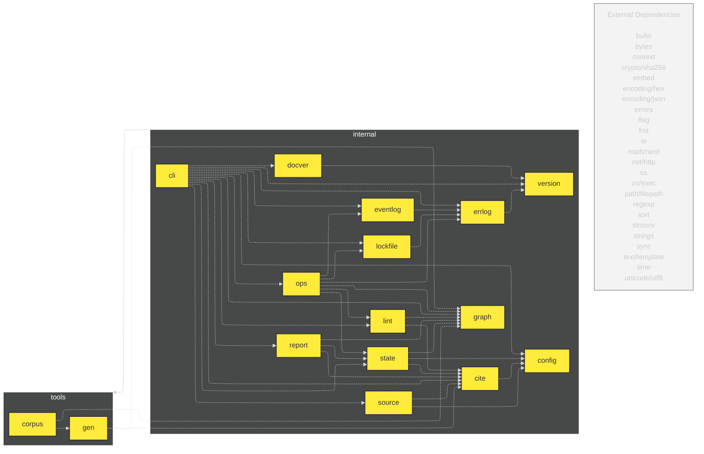

# Code Structure Diagram

```mermaid
---
config:
  look: classic
  darkMode: true
  theme: dark
  layout: elk
  elk:
    mergeEdges: true
    nodePlacementStrategy: NETWORK_SIMPLEX
---
graph LR
    %% Color definitions
    classDef no_deps fill:#90EE90,stroke:#333,stroke-width:2px,color:#333
    classDef has_deps fill:#FFEB3B,stroke:#333,stroke-width:2px,color:#333
    classDef bad_deps fill:#FF6B6B,stroke:#333,stroke-width:2px,color:#333
    classDef external fill:#E0E0E066,stroke:#666,stroke-width:1px

    %% Directory hierarchy
    __3a52ce78 ---> tools_0284c6ac

    %% Directory structure and files
    subgraph __3a52ce78["internal"]
        cite_f7064cd7["cite"]:::has_deps
        cli_2bd8e9c9["cli"]:::has_deps
        config_dfba7aad["config"]:::has_deps
        docver_6eba3a90["docver"]:::has_deps
        errlog_a6fd2db4["errlog"]:::has_deps
        eventlog_f5caa859["eventlog"]:::has_deps
        graph_29a184b6["graph"]:::has_deps
        lint_b504838c["lint"]:::has_deps
        lockfile_649ab61f["lockfile"]:::has_deps
        ops_c62973cc["ops"]:::has_deps
        report_a27297bd["report"]:::has_deps
        source_828d338a["source"]:::has_deps
        state_aa4a5f81["state"]:::has_deps
        version_c692273d["version"]:::has_deps
    end
    subgraph tools_0284c6ac["tools"]
        tools_corpus_0198e50f["corpus"]:::has_deps
        tools_gen_568ea8cb["gen"]:::has_deps
    end

    %% Import dependencies
    cite_f7064cd7 -.-> config_dfba7aad
    cli_2bd8e9c9 -.-> cite_f7064cd7
    cli_2bd8e9c9 -.-> config_dfba7aad
    cli_2bd8e9c9 -.-> docver_6eba3a90
    cli_2bd8e9c9 -.-> errlog_a6fd2db4
    cli_2bd8e9c9 -.-> eventlog_f5caa859
    cli_2bd8e9c9 -.-> graph_29a184b6
    cli_2bd8e9c9 -.-> lint_b504838c
    cli_2bd8e9c9 -.-> lockfile_649ab61f
    cli_2bd8e9c9 -.-> ops_c62973cc
    cli_2bd8e9c9 -.-> report_a27297bd
    cli_2bd8e9c9 -.-> source_828d338a
    cli_2bd8e9c9 -.-> state_aa4a5f81
    cli_2bd8e9c9 -.-> version_c692273d
    docver_6eba3a90 -.-> version_c692273d
    errlog_a6fd2db4 -.-> version_c692273d
    eventlog_f5caa859 -.-> errlog_a6fd2db4
    lint_b504838c -.-> cite_f7064cd7
    lint_b504838c -.-> graph_29a184b6
    lockfile_649ab61f -.-> errlog_a6fd2db4
    ops_c62973cc -.-> errlog_a6fd2db4
    ops_c62973cc -.-> eventlog_f5caa859
    ops_c62973cc -.-> graph_29a184b6
    ops_c62973cc -.-> lint_b504838c
    ops_c62973cc -.-> lockfile_649ab61f
    ops_c62973cc -.-> state_aa4a5f81
    report_a27297bd -.-> cite_f7064cd7
    report_a27297bd -.-> graph_29a184b6
    report_a27297bd -.-> state_aa4a5f81
    source_828d338a -.-> cite_f7064cd7
    source_828d338a -.-> config_dfba7aad
    state_aa4a5f81 -.-> cite_f7064cd7
    state_aa4a5f81 -.-> config_dfba7aad
    state_aa4a5f81 -.-> graph_29a184b6
    tools_corpus_0198e50f -.-> graph_29a184b6
    tools_corpus_0198e50f -.-> tools_gen_568ea8cb
    tools_gen_568ea8cb -.-> cite_f7064cd7
    tools_gen_568ea8cb -.-> graph_29a184b6

    %% External dependencies
    external["External Dependencies<br/><br/>bufio<br/>bytes<br/>context<br/>crypto/sha256<br/>embed<br/>encoding/hex<br/>encoding/json<br/>errors<br/>flag<br/>fmt<br/>io<br/>math/rand<br/>net/http<br/>os<br/>os/exec<br/>path/filepath<br/>regexp<br/>sort<br/>strconv<br/>strings<br/>sync<br/>text/template<br/>time<br/>unicode/utf8"]:::external
    __3a52ce78 ~~~ external
```
